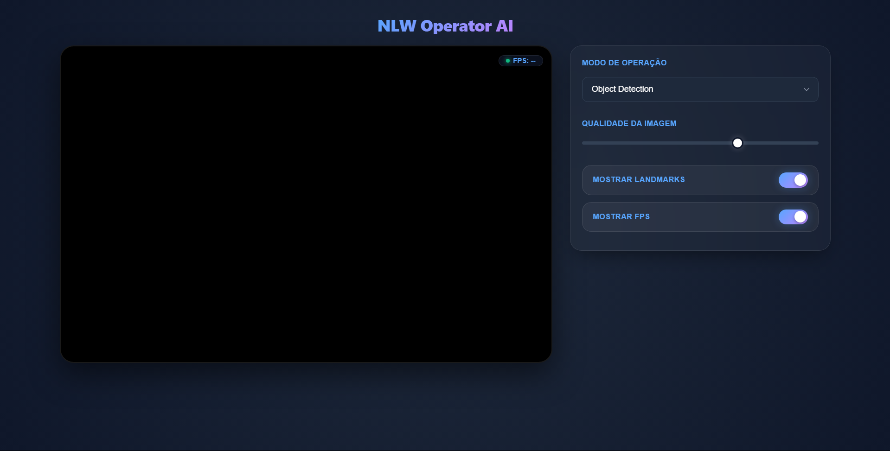

<h1 align="center">🤖 NLW Operator Python</h1>

  <a href="#-o-projeto">O Projeto</a>&nbsp;&nbsp;&nbsp;|&nbsp;&nbsp;&nbsp;
  <a href="#-tecnologias">Tecnologias</a>&nbsp;&nbsp;&nbsp;|&nbsp;&nbsp;&nbsp;
  <a href="#-layout">Como Rodar</a>

  

## 💻 O Projeto

**NLW Operator AI** é uma aplicação web de visão computacional em tempo real que processa o feed da webcam diretamente no navegador. O sistema opera em dois modos: **Object Detection**, que identifica e enquadra objetos com bounding boxes usando um modelo EfficientDet, e **Gesture Recognition**, que rastreia os pontos das mãos e classifica gestos personalizados com um modelo treinado pelo próprio usuário — tudo transmitido via WebSocket com latência mínima.

Os principais destaques do desenvolvimento incluem:

1. **Arquitetura WebSocket bidirecional:** O frontend captura frames da webcam em canvas, serializa em JPEG e envia via WebSocket para o backend Python. O servidor processa com MediaPipe/OpenCV, retorna os frames anotados e os metadados (labels, FPS) em canais separados — texto JSON para dados, bytes brutos para imagem.
2. **Pipeline de ML customizável:** O projeto inclui scripts completos para coleta de landmarks (`collect.py`), treinamento de um classificador Random Forest com scikit-learn (`train.py`) e inferência em tempo real. O usuário pode treinar seus próprios gestos sem alterar uma linha do código principal.
3. **Interface glass-morphism com controles reativos:** A UI foi construída com FastHTML puro (sem JS externo), com painel de controles que ajusta modo de operação, qualidade de compressão JPEG e visibilidade de landmarks em tempo real, aplicando as mudanças via mensagens de configuração no próprio canal WebSocket.

## 🚀 Tecnologias

* **Python + FastHTML:** Servidor web assíncrono com roteamento declarativo e endpoint WebSocket nativo para streaming de frames processados.
* **MediaPipe:** Utilizado para dois pipelines distintos — `ObjectDetector` com modelo TFLite EfficientDet Lite0 e `GestureRecognizer` para detecção de landmarks das mãos com até 2 mãos simultâneas.
* **OpenCV:** Conversão de espaço de cor BGR/RGB, flip de espelhamento para o modo gesto, codificação JPEG com qualidade variável e desenho de bounding boxes e landmarks.
* **scikit-learn (Random Forest):** Classificador treinado sobre as coordenadas x, y, z dos 21 landmarks da mão, com divisão treino/teste estratificada e exportação via joblib.
* **NumPy:** Decodificação de buffers de bytes em arrays de imagem para processamento com OpenCV.
* **pandas:** Gerenciamento do dataset CSV de landmarks coletados, incluindo contagem de distribuição de classes.
* **JavaScript (Vanilla):** Captura de webcam via `getUserMedia`, pipeline de envio de frames com `requestAnimationFrame`, controle de taxa (cap em 30fps), e renderização assíncrona dos frames retornados via `Blob URL`.
* **Git & GitHub:** Versionamento e hospedagem do projeto.

## 🔖 Como Rodar

**Para rodar no seu computador (Local):**

1. Clone o repositório e instale as dependências com `uv sync` (ou `pip install -r requirements.txt`).
2. Os modelos necessários (`efficientdet_lite0.tflite` e `gesture_recognizer.task`) já estão incluídos na pasta `models/`. Caso queira atualizá-los, basta substituí-los na mesma pasta.
3. Execute `python app.py` e acesse `http://localhost:5001` no navegador — permita o acesso à webcam quando solicitado.

> **Para treinar gestos personalizados:** rode `python collect.py` para capturar dados, depois `python train.py` para gerar o modelo `gesture_model.pkl`.

---

Feito com 💜 por **[AlissonFA](https://www.linkedin.com/in/alissonfa/)**